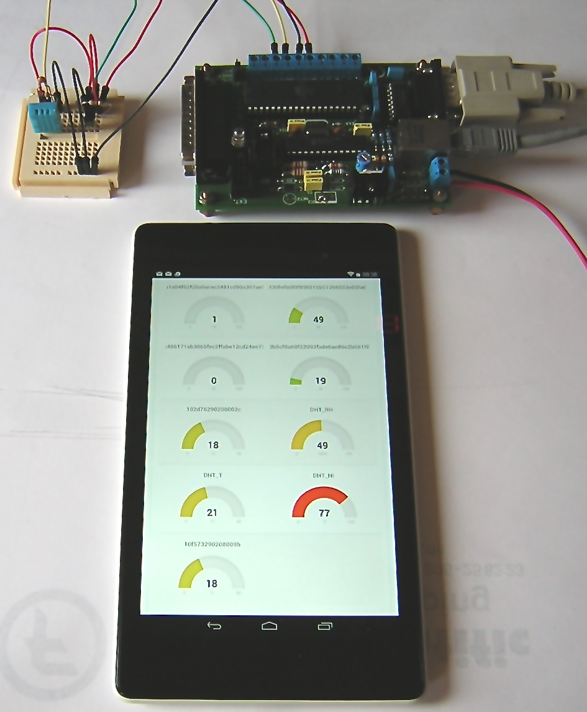

#Sensors to MQTT

This sketch reads the value from Dallas/Maxim DS18x20 one-wire temperature sensors and from a DHT11 humidity sensor and sends corresponding MQTT messages to the Fluksometer (or any other) MQTT broker. The temperature sensors are automatically detected using the referred example code - license as provided. The same applies to the DHT11.
The result is directly integrated into the panel output provided in the Raspberry section respective in [http://github.com/gebhardm/flmdisplay](http://github.com/gebhardm/flmdisplay).

Note: Make sure to uncomment the right Ethernet-include as this sketch will also work with a real Arduino w/ Ethernet shield or Arduino Ethernet!
