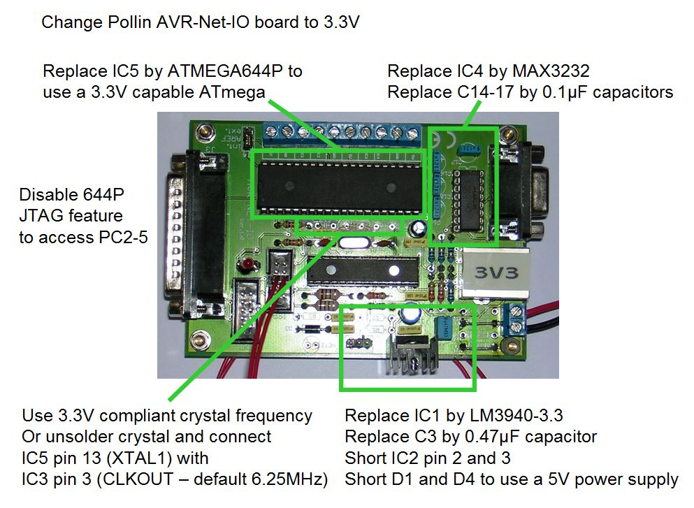
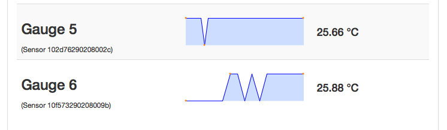

#AVRNetIOduino
This hack is based on different internet sources to actually use the Arduino IDE also on a Pollin AVR NetIO board avaliable as kit for just 20 Euros; see [www.pollin.de](www.pollin.de). This enables a rather cheap variant of the Arduino plus Ethernet option.

The bootloader source file is taken from the Arduino 1.0.2 sources and is enhanced to work also with both an Atmel ATmega644P and ATmega32 on the Pollin AVR NetIO.

Additionally an AVRNetIO board was altered to work with an ATmega644P on 3.3V only.

Test was successful using the AVRNetIO w/ ATmega32 and 644P and Jean-Claude Wippler's EtherCard implementation; note to change the select pin of the ethercard examples from default 8 to 4 (PB4 - better use the global variable SS).

AVRNetIO works also fine using UIPEthernet by Norbert Truchsess; see
[Github:NTruchsess](https://github.com/ntruchsess/arduino_uip)

There are surely different sources that did the same adaptation already; but after fiddling two days with the Sanguino bootloader code and not succeeding (device ID not read?!), I tried to enhance the original Arduino bootloader from scratch and by that learn about its behavior.

Put the /AVRNetIO/ folder into the Arduino's hardware folder; use a LED on the
J11 jumper header to see bootloader activity (LEDpin now is 1).

See /AVRNetIO_rbbb_server/ for an easy webserver enabling switching Outputs 1 to 8, getting Inputs 1 to 4, and readings from ADC 1 to 4.

See /AVRNetIO_MQTT/ for a very basic implementation of MQTT publishing to the [Fluksometer's MQTT broker](http://www.flukso.net) (or any other broker) to display port readings.

See /AVRNetIO_MQTT_DS/ to publish temperature data from Dallas DS18x20 sensors

For an ATmega644P use following fuse settings:

<table>
<tr><td>Fuse HIGH</td><td>0xDC</td><td>JTAG disable, Bootloader active with size 1024 words</td></tr>
<tr><td>Fuse LOW</td><td>0xE0</td><td>No clock divider, external clock source for feeding from ENC28J60</td></tr>
<tr><td>Fuse Extended</td><td>0xFF</td><td>default setting</td></tr>
</table>

The code is under the given sources license.

Sources used

* [sanguino.cc](http://sanguino.cc/)
* [jcw/ethercard](https://github.com/jcw/ethercard)
* [ntruchsess/arduino_uip](https://github.com/ntruchsess/arduino_uip)
* [knolleary/PubSubClient](https://github.com/knolleary/pubsubclient)
* [Flukso.net](http://flukso.net)

Markus Gebhard, Karlsruhe, November 2012 - August 2014
