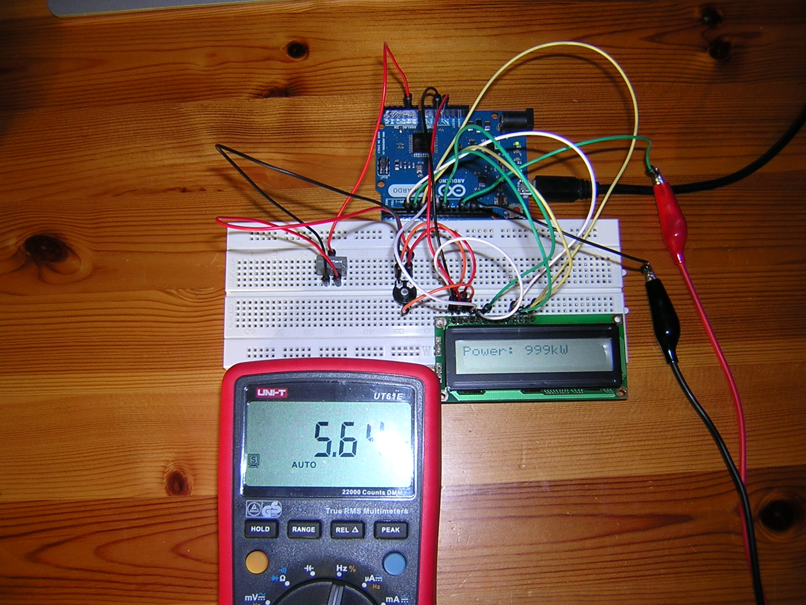
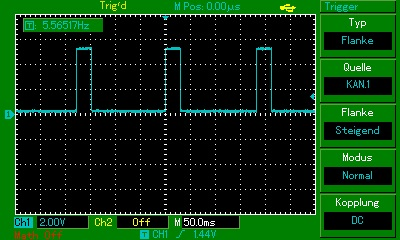
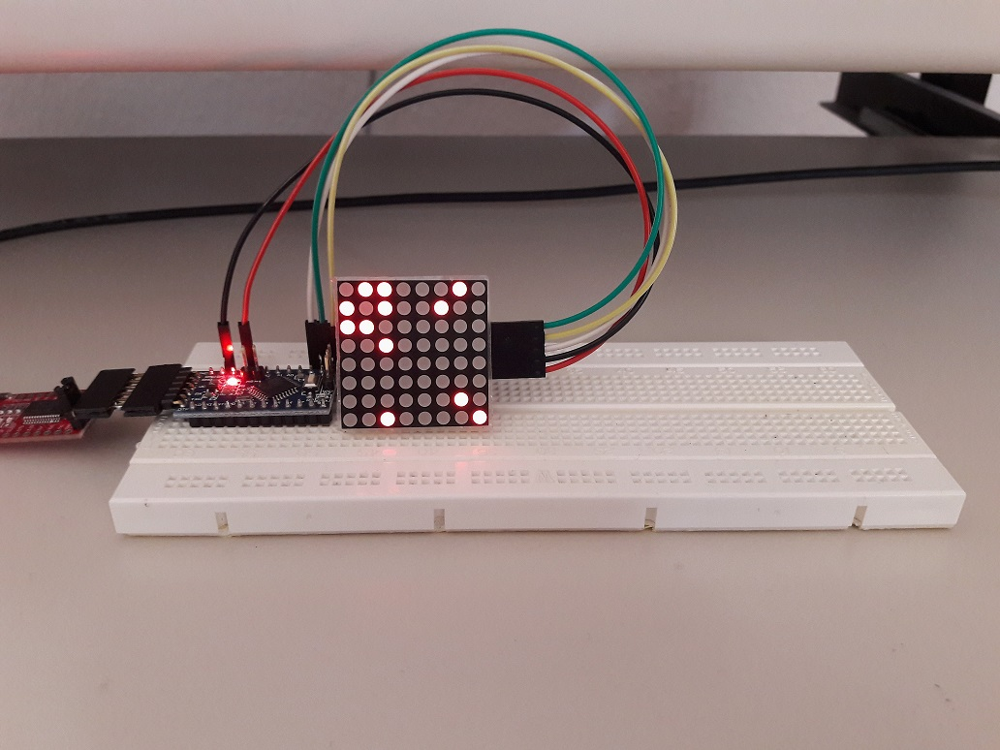
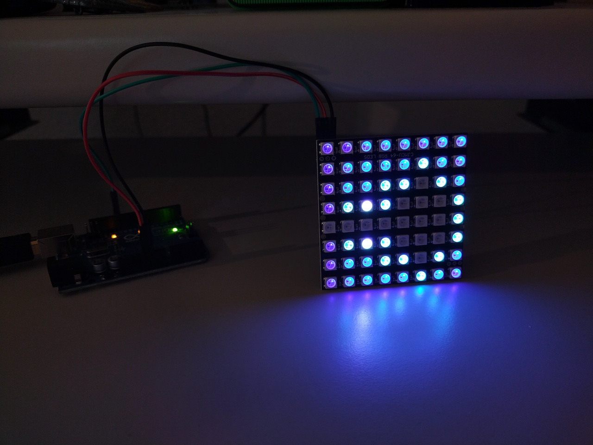
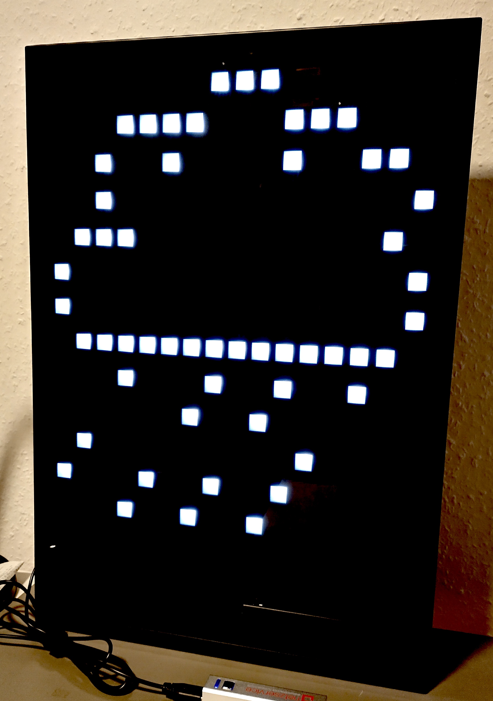

# Arduino

This folder contains some sketches used with the Arduino to achieve
certain functions.

## 20mA current loop converter
The 20mA Konverter sketch translates a 20mA current loop power equivalent of a
current clamp to an S0 compliant impulse used to monitor the output
of a wind turbine. In its default configuration 1 impulse is generated
per 50 Wh. Also a non-zero offset power is subtracted (reactive power); note that these settings have to correspond to the actual type of current loop used (0-20mA vs 4-20mA for full range).

## Uno (or Leonardo) NTP receiver
The Uno NTP ENC28J60 sketch sends Network Time Protocol packages to a
time server and receives the corresponding time packages via UDP; time
is output to the serial connection. It uses [Norbert Truchsess' Arduino UIP ENC28J60 library](https://github.com/ntruchsess/arduino_uip). 
This sketch works with an Arduino Uno and attached ENC28J60 module. For use with an Arduino Leonardo the Slave Select assignment has to be changed in the library file [Enc28J60Network.h](https://github.com/ntruchsess/arduino_uip/blob/master/utility/Enc28J60Network.h#L30).

## Game of Life
In memory of John Horton Conway this sketch implements (yet another time) the Game of Life on an Arduino (Mini Pro) with attached MAX7219 controlled LED matrix.

## Mandelbrot Set
As an example for having an alternative display on an IKEA Obegränsad LED lamp this is the Arduino preparation to display the classic Mandelbrot Set, the "Apfelmännchen".

## Weather Station
Using the year end vacation to "finally" get something useful on the IKEA Obegränsad LED lamp, I implemented a temperature, relative humidity and iconized pressure display, using an Arduino Mini with an BMP280 environment sensor. It works, when the mapping is right :-)
For more information, refer to the code in the [Envi_Obegraensad](Envi_Obegraensad/) folder.

