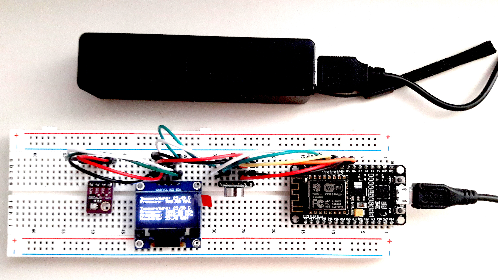

# ESP8266
Finally I also got some of these tiny little wonder chips that revolutionized the way 
to make an appliance wifi capable. 
After reading some tutorials and getting the Arduino IDE up and running with a 
"Generic ESP8266 Module" respectively a NodeMCU this section contains sketches on utlizing these magnificent pieces
of hardware.

