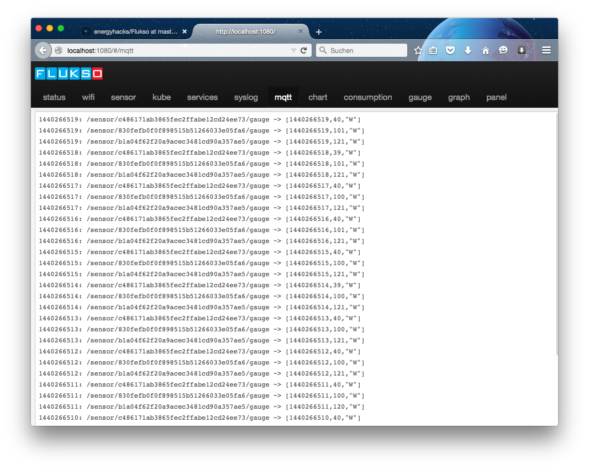

# Flukso tips and tricks
This folder contains tips and tricks with respect to running a Fluksometer (FLM).

For the FLM itself, please refer to [www.flukso.net](http://www.flusko.net)

## Testing FLMlocal things locally
My repository [FLMlocal](https://github.com/gebhardm/flmlocal) contains a tweak of the Fluksometer's own webserver files. This software not necessarily has to run on a Fluksometer. For test purposes I copy the FLM's www/-content onto my Mac and "play" with it without interfering with FLM operations.

To do the same, perform following steps:

	scp -r root@<FLM IP address>:/www/* .
	
Copy the FLM's webserver content onto your desktop into a convenient folder, for example `/Users/<user>/Documents/Projects/FLMsandbox`.
Also copy a simple nodejs-based webserver into the same directory, e.g. [simple_http_server.js](simple_http_server.js) - you may, of course, use another webserver able to serve the www/-contained index.html-file.
Start the webserver having [nodejs](http://nodejs.org) installed.

	node simple_http_server.js &
	
From your browser call `localhost:1080` and access the locally available FLM-UI.
Here you now may alter all files and test your changes with a browser refresh.
Note that partly in www/script/controller/-contained files the target address may require to be tweaked also:

	var broker = '<FLM IP address>'; //location.host;
	
Otherwise the FLM-MQTT-broker is not reached; be aware to change it back when you want to tweak your FLM again; see for example [the line to tweak the gauge display](https://github.com/gebhardm/flmlocal/blob/master/www/scripts/controllers/gauge.js#L38); leave the port unchanged.

