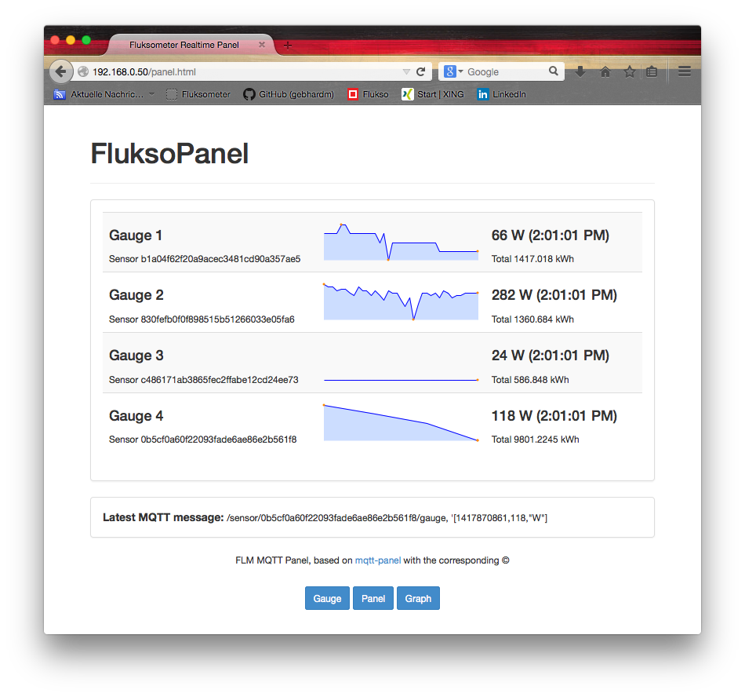
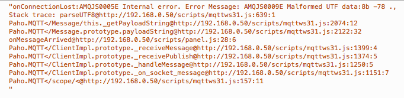

#FLM local gauges
To get the capability to show a gauge, graph and panel
from your [Fluksometer](http://flukso.net) directly (within the LAN, no internet access required), copy the content of the [www/](www/) folder to your FLM with firmware verion >2.4.
Use the linux/OSX command **scp** for this purpose; for windows use WinSCP.

`scp -r * root@<FLM ip address>:/www/`

You are prompted for the root's password, then all necessary files are transferred (option -r)

Note: The used library of the MQTT websockets connector *mqttws31.js* tends to lose connection due to an internal error - this needs to be investigated; for the moment just refresh your browser window.

 

