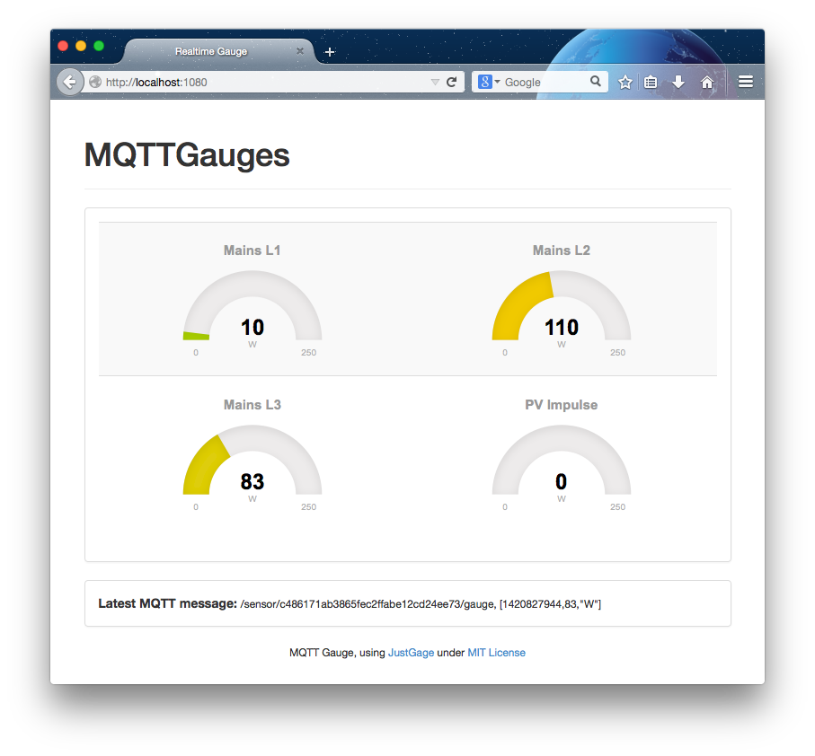

# Simple MQTT Gauges

This hack is a tiny node.js based web server that subscribes to an MQTT topic from a sensor publisher and displays the received values as gauges using the [JustGage](http://justgage.com/) visualization; it computes payloads with the format

     [<value:number(int or float)>,"<unit:string>"] or [<timestamp>, <value>, "<unit>"]

Actually this is a rip of the Fluksometer display to be found in [gebhardm/flmdisplay](https://github.com/gebhardm/flmdisplay/tree/master/combined)

To run the script, use

    node serve_mqtt.js  (alternative: ./servemqtt.sh)

after having installed [node.js](http://nodejs.org) and the node modules **mdns**, **mqtt** and **socket.io** - via the *package.json* file these dependencies are automatically resolved by executing

    npm install

Access the served web page on port **1080** of your 'http://localhost:1080' or 'http://ip-address:1080' or whatever port you define in the [*serve_mqtt.js*](serve_mqtt.js).

    var httpport = 1080;

Via MDNS, available MQTT brokers are automatically detected and subscribed to; alternatively define your preferred mqtt broker manually, for example by

    var mqttbroker = '192.168.0.50', mqttport = '1883';

Be aware that on manual definition the call of *mqttconnect()* must be done "outside" the 'mdnsbrowser.on("serviceUp", function(service))}' declaration.
