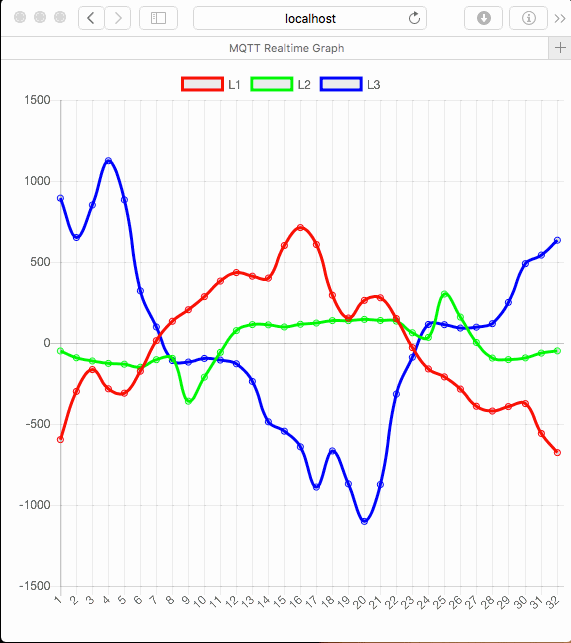

# MQTT Realtime Graph
As a tool to debug the new Fluksometer version 3 this little webserver enables a realtime graph of the provided voltage or current readings (apply what you want in the [topic subscription](https://github.com/gebhardm/energyhacks/blob/master/MQTTrealtime/mqttrealtime.js#L69)).

If you want to use this also, make sure to change the mqtt broker's address in [mqttrealtime.js](https://github.com/gebhardm/energyhacks/blob/master/MQTTrealtime/mqttrealtime.js#L22); start it with ```node mqttrealtime.js``` (assuming node installed and this software configured via ```npm install```).



This visualization uses [chart.js](http://www.chartjs.org/). The recording has been made with [LICEcap](http://www.cockos.com/licecap/). And as server infrastructure I use [node.js](https://nodejs.org).

As usual, all code under MIT license; be fair!