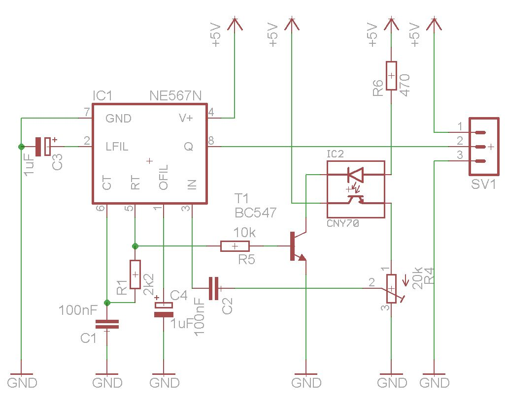

# Optic Pulse Sensor

Use a NE567 to detect the reading of a reflexive optocoupler and drive the LED of an optocoupler
for galvanic decoupled open-collector output; the plain version is without the extra optocoupler
as the 567 has open collector (OC) output (in this case w/o galvanic decoupling).

Use the trimmer resistor to correctly detect light reflexion.

This schematics is set up corresponding to the many standard layouts to build a light barrier.
The frequency of the 567's oscillator is set to around 4 kHz, enough to prevent stray light
irritations.

Markus Gebhard, February 2013

Under MIT license.
