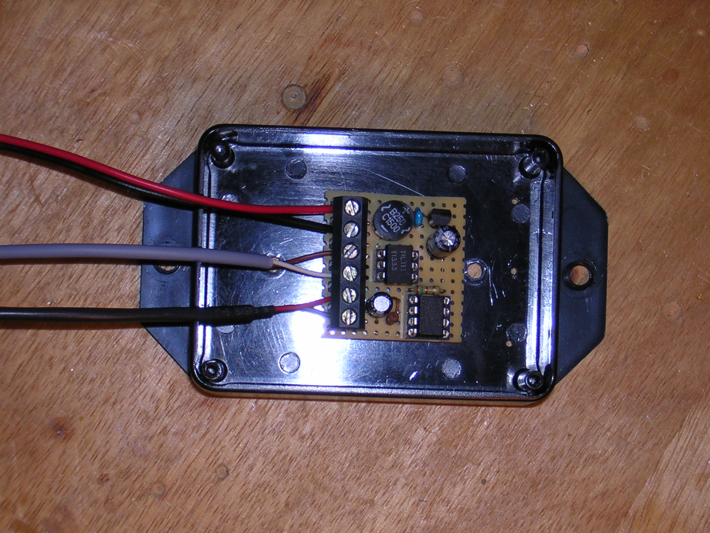

# Impulsformer
"Impulsformer" provides a little converter that transforms the current
measured by one respective three current clamp(s) (as used by the 
Fluksometer - see www.flukso.net) to an S0-conformant impulse set, 
in the example case 1000 impulses per measured kWh.

The basic use of the converter is for the Fluksometer to enhance it
by one (or three or more, as the used microcontroller's ADCs are not
fully utilized) analog input(s).

The given schematics, board and corresponding software are based on an
Atmel ATtiny13(A) and just a few external components.

The used voltage converter is a low drop variant capable to be "clamped"
to the existing Fluksometer's AC/DC module, so not requiring an
additional voltage source.

The microcontroller may be driven also with lower Vcc and different
operating frequency; the given outline of the one clamp variant is working fine...

Markus Gebhard, Karlsruhe, Germany, April/May 2012

Greetings to the participants of the electrocamp ec1205 held May 4th/5th in Offenburg.
It has been a pleasure taking part...
