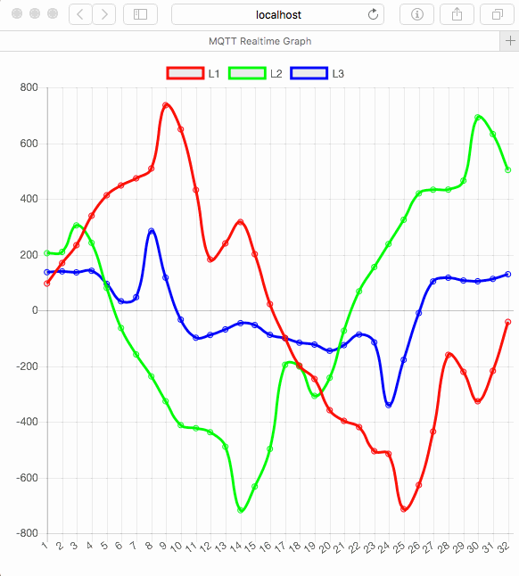

# MQTT Realtime Graph
As a tool to debug the new Fluksometer version 3 this little webserver enables a realtime graph of the provided voltage and current readings.

Note to change the mqtt broker's address in [mqttrealtime.js](https://github.com/gebhardm/energyhacks/blob/master/MQTTrealtime/mqttrealtime.js#L22); start it with ```node mqttrealtime.js```.



Note: A Raspberry Pi seems too slow for handling MQTT receiving and websocket feeding...