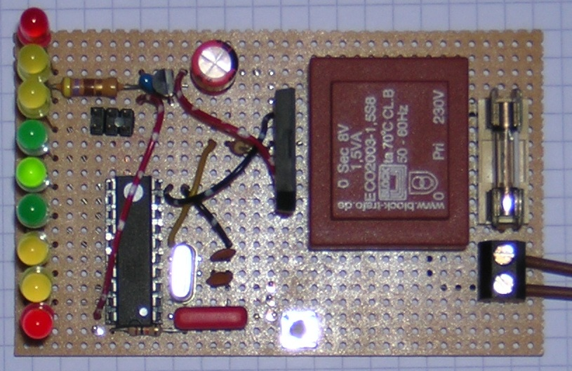

# Measuring the mains frequency

This device shows with 9 LEDs the current frequency on which the grid
operates.

In Europe the mean grid frequency is 50Hz. Due to increasing
amount of renewable energy put into the grid it is said by the grid
administration "that it is hard to maintain the mean 50Hz". Thus by
too much power in the grid, the frequency rises (see the 50.2Hz problem
in the internet...)

This device - inspired by an Elektor article from January 2012 - allows
to check what is on the grid.
The current code indicates frequencies between 49,8Hz and 50,2Hz...

Have fun.

Markus Gebhard, Jan to July 2012

Needless to say: The grid's voltage may be harmful, so keep your fingers
off this device if you are not sure what you are doing ;-)
